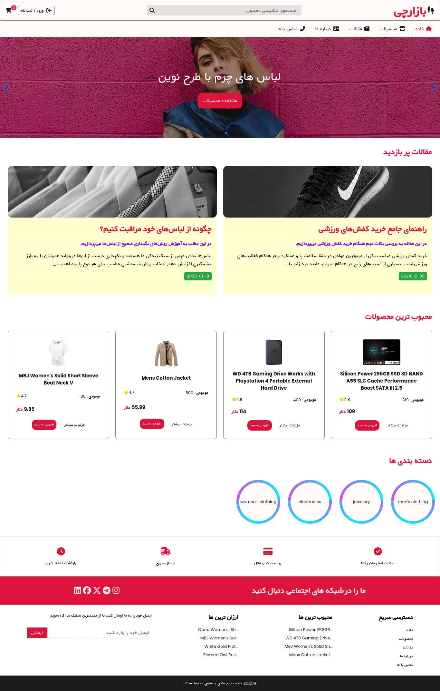
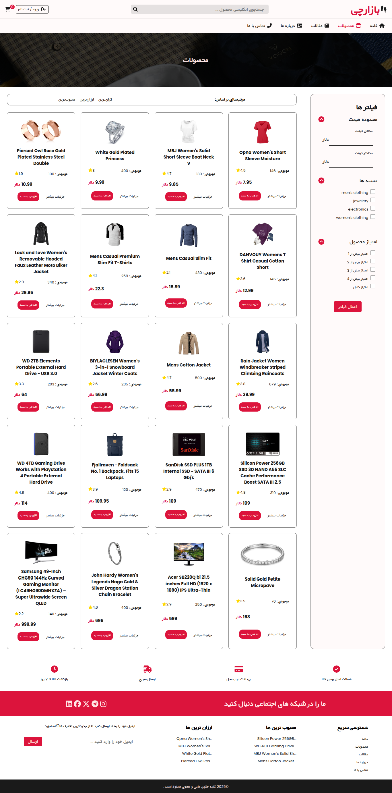
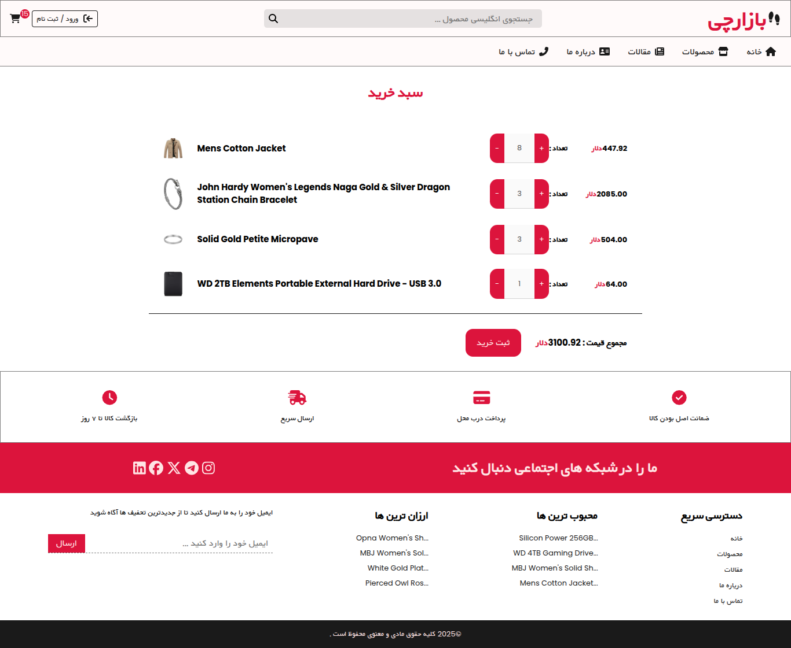

## 🛍️ بازارچی - Shopping Project

A modern, responsive **shopping web app** built with **React + Vite + React-Router-Dom + Context API + Reducers**. It fetches product data from the [FakeStore API](https://fakestoreapi.com/), features a dynamic cart, and uses Swiper JS for product/image sliders. The UI is entirely in Persian and RTL-friendly.

---

### ✨ Features

* 🌐 **Persian Language UI** (RTL-friendly)
* 🔍 **Live Product Search** with real-time filtering
* 🛒 **Shopping Cart** with quantity management
* 📱 **Responsive Design** with mobile-first support
* 🔐 **Login/Register UI** (no backend)
* 🧭 **Scroll-Aware Navbar**
* 💬 **Modal System** for menus and overlays
* 🌐 **Client-side Routing** with React Router
* 📡 **Fetches product data from [FakeStore API](https://fakestoreapi.com/)**

---

### ⚠️ Note on Authentication

Login and Register pages are **UI-only**:

* Validate that fields are not empty
* Ensure `password` and `repassword` match
* ⚠️ No backend or authentication system is implemented

---

### 🧰 Technologies Used

* ⚡ **Vite** – lightning-fast dev server and build tool
* ⚛️ **React**
* 🛣 **React Router DOM**
* 🎯 **FontAwesome** (for icons)
* 🎨 **Vanilla CSS** with custom utility classes & variables
* 🧠 **Context API + Reducers**
* 🛍️ **FakeStore API** – provides product data

---

### 🚀 Getting Started

#### 1. Clone the repository

```bash
git clone https://github.com/hassanhajizadeh/MyShop.git
cd MyShop
```

#### 2. Install dependencies

```bash
npm install
```

#### 3. Start the development server

```bash
npm run dev
```

Visit the app in your browser at: [http://localhost:5173](http://localhost:5173)

---

### 📁 Project Structure

```
├── Fonts/
│
├── public/
|   │
|   └── blogImages/
|
└── src/
    │
    ├── components/           # Navbar, SearchBar, Cart UI, etc.
    ├── context/              # Global state and modal logic
    ├── pages/                # Product list, Product detail, Cart, Auth
    ├── index.css               # CSS files (vanilla)
    ├── App.jsx               # Main component with routes
    └── main.jsx              # Vite entry point
```

---

### 📦 Product API

Products are fetched from:
📡 [https://fakestoreapi.com/products](https://fakestoreapi.com/products)

Example product:

```json
{
  "id": 1,
  "title": "Fjallraven - Foldsack No. 1 Backpack",
  "price": 109.95,
  "description": "Your perfect pack for everyday use...",
  "category": "men's clothing",
  "image": "https://fakestoreapi.com/img/81fPKd-2AYL._AC_SL1500_.jpg"
}
```

---

### 📝 Notes

* The website is **entirely in Persian** and supports **RTL layout**.
* Product searches and UI elements are all localized accordingly.

---

### 📸 Screenshots






---

### 📜 License

This project is licensed under the [MIT License](LICENSE).
